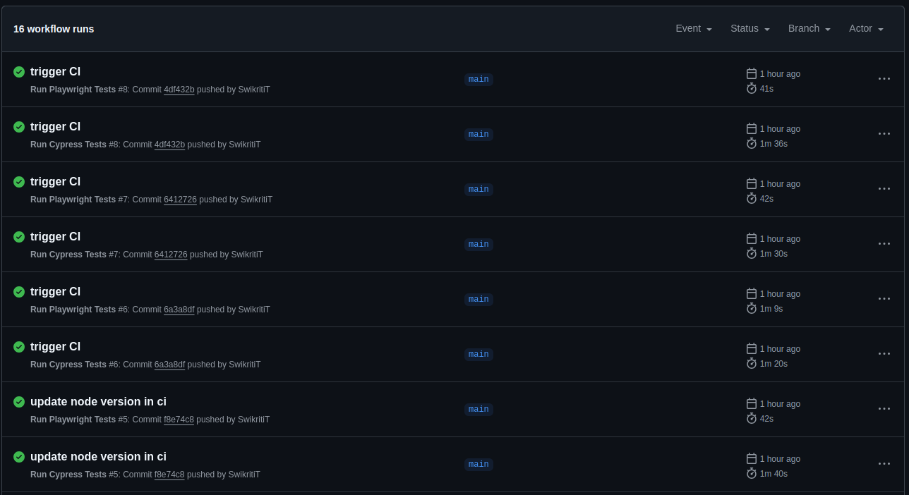
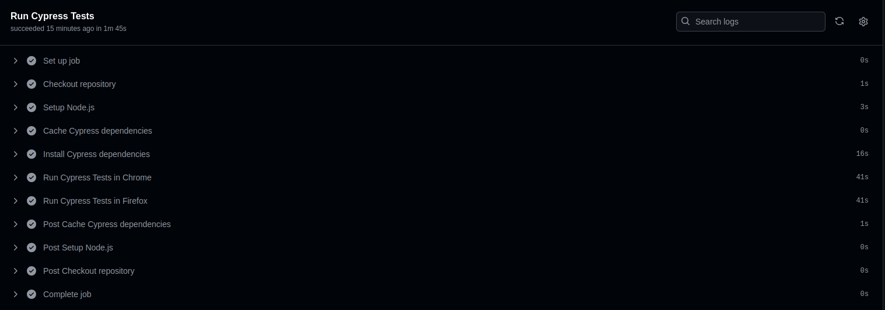
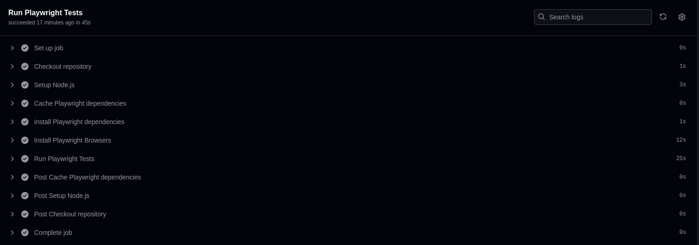

## Comparing Test Execution Speed: Cypress vs Playwright for Modern Test Automation Frameworks

As the testing world increasingly shifts towards automation, tests must run efficiently in a CI/CD environment. Quick feedback on the latest code changes is critical—nobody wants to wait an hour or more to see if their pull request passes. Additionally, CI/CD services can be costly, so minimizing execution time directly translates to saving money. Every millisecond counts in this modern testing landscape.

With this in mind, I experimented to compare the test execution speed of two of today’s most popular modern test automation frameworks: [Cypress](https://www.cypress.io/) and [Playwright](https://playwright.dev/).

If you're not already familiar with these frameworks, here's a brief introduction to each:

**Cypress** is a front-end testing tool designed for modern web applications. Initially built for end-to-end testing, it has since expanded its capabilities to include component testing, accessibility testing, and more. Cypress supports test scripting in JavaScript and TypeScript and offers compatibility with Chromium-based browsers, Firefox, and WebKit (experimental). It operates directly in the browser, providing a seamless developer experience with features like built-in debugging, automatic waiting, and real-time reloading.

**Playwright** is an end-to-end testing framework for modern web applications that supports multiple programming languages, including JavaScript, TypeScript, Python, C#, and Java. It fully supports all major browser engines—Chromium, WebKit, and Firefox—making it an excellent choice for cross-browser testing. With powerful features like multiple browser context handling, parallel execution, and robust language integrations, Playwright is ideal for scalable and efficient test automation in diverse environments.

For this project, I wrote end-to-end tests in a TDD style using both frameworks for the [Swaglabs V1 demo website](https://www.saucedemo.com/v1/index.html). You can find the test scripts in [my GitHub repository here](https://github.com/SwikritiT/swaglabs-tests).

I created three test files for each framework, covering the following functionalities:

- Logging in
- Adding items to the cart
- Checking out

To ensure a fair comparison, I used the same selectors and functions across both frameworks as much as possible. This approach helps maintain consistency and minimizes discrepancies in the results.

---

## File structure

For this project, I created a root directory named `swaglabs-tests`, which contains two sub-folders: `cypress-tests` and `playwright-tests`.

**File structure for `cypress-tests`**

```bash
cypress-tests
 ┣ cypress
 ┃ ┣ downloads
 ┃ ┣ e2e
 ┃ ┃ ┣ addToCart.cy.js
 ┃ ┃ ┣ checkout.cy.js
 ┃ ┃ ┗ login.cy.js
 ┃ ┗ support
 ┃ ┃ ┣ commands.js
 ┃ ┃ ┣ e2e.js
 ┃ ┃ ┗ helpers.js
 ┣ README
 ┣ cypress.config.js
 ┣ package-lock.json
 ┗ package.json
```

**File structure for `playwright-tests`**

```bash
playwright-tests
 ┣ helpers
 ┃ ┗ helpers.js
 ┣ playwright-report
 ┃ ┗ index.html
 ┣ test-results
 ┃ ┗ .last-run.json
 ┣ tests
 ┃ ┣ addToCart.spec.js
 ┃ ┣ checkout.spec.js
 ┃ ┗ login.spec.js
 ┣ package-lock.json
 ┣ package.json
 ┗ playwright.config.js
```

---

## Test execution

Each framework contains 3 test suites with a total of 9 tests:

- Login Suite: 5 tests
- Add to Cart Suite: 2 tests
- Checkout Suite: 2 tests

### In Local Machine

The tests were executed in both headless and headed modes using the Chrome browser.

**Cypress Execution in Headless Mode**

```bash
(Run Finished)


       Spec                                              Tests  Passing  Failing  Pending  Skipped
  ┌────────────────────────────────────────────────────────────────────────────────────────────────┐
  │ ✔  addToCart.cy.js                          00:09        2        2        -        -        - │
  ├────────────────────────────────────────────────────────────────────────────────────────────────┤
  │ ✔  checkout.cy.js                           00:10        2        2        -        -        - │
  ├────────────────────────────────────────────────────────────────────────────────────────────────┤
  │ ✔  login.cy.js                              00:06        5        5        -        -        - │
  └────────────────────────────────────────────────────────────────────────────────────────────────┘
    ✔  All specs passed!                        00:26        9        9        -        -        -

```

Cypress executed the tests in 26 seconds, with repeated runs showing execution times ranging from 21 seconds to 26 seconds, averaging 24 seconds.

**Playwright Execution in Headless Mode**

By default, Playwright runs tests in parallel across multiple workers. To ensure a fair comparison with Cypress, I configured Playwright to run tests sequentially with a single worker by updating the `playwright.config.js` file:

```js
//playwright.config.js

export default defineConfig({}
    .....

	fullyParallel: false, // Disable parallel execution
    workers: 1, // Use a single worker
)
```

```bash
Running 9 tests using 1 worker

  ✓  1 [chromium] › addToCart.spec.js:9:6 › Add to cart › user adds a item to cart (3.9s)
  ✓  2 [chromium] › addToCart.spec.js:13:6 › Add to cart › user adds multiple items to cart (1.9s)
  ✓  3 [chromium] › checkout.spec.js:9:6 › checkout › user checks-out a item from the cart (2.2s)
  ✓  4 [chromium] › checkout.spec.js:14:6 › checkout › user checks-out multiple items from the cart (2.1s)
  ✓  5 [chromium] › login.spec.js:9:6 › Login › normal user logs in (1.5s)
  ✓  6 [chromium] › login.spec.js:18:6 › Login › locked out user logs in (435ms)
  ✓  7 [chromium] › login.spec.js:28:6 › Login › user logs in with no password (443ms)
  ✓  8 [chromium] › login.spec.js:37:6 › Login › user submits empty form (394ms)
  ✓  9 [chromium] › login.spec.js:45:6 › Login › user logs in with incorrect password (423ms)

  9 passed (13.8s)

```

Playwright completed the execution in around 14 seconds, with repeated runs ranging from 13 seconds to 15 seconds, averaging at 14 seconds. This is almost half the time Cypress took.

---

**Cypress Execution in Headed Mode**

```bash
  (Run Finished)

       Spec                                              Tests  Passing  Failing  Pending  Skipped
  ┌────────────────────────────────────────────────────────────────────────────────────────────────┐
  │ ✔  addToCart.cy.js                          00:06        2        2        -        -        - │
  ├────────────────────────────────────────────────────────────────────────────────────────────────┤
  │ ✔  checkout.cy.js                           00:09        2        2        -        -        - │
  ├────────────────────────────────────────────────────────────────────────────────────────────────┤
  │ ✔  login.cy.js                              00:06        5        5        -        -        - │
  └────────────────────────────────────────────────────────────────────────────────────────────────┘
    ✔  All specs passed!                        00:21        9        9        -        -        -


```

In headed mode, Cypress executed the tests in 21 seconds. The execution time ranged from 20 to 22 seconds in repeated runs, averaging at 21 seconds.

**Playwright Execution in Headed Mode**

```bash
Running 9 tests using 1 worker

  ✓  1 [chromium] › addToCart.spec.js:9:6 › Add to cart › user adds a item to cart (3.9s)
  ✓  2 [chromium] › addToCart.spec.js:13:6 › Add to cart › user adds multiple items to cart (2.0s)
  ✓  3 [chromium] › checkout.spec.js:9:6 › checkout › user checks-out a item from the cart (3.1s)
  ✓  4 [chromium] › checkout.spec.js:14:6 › checkout › user checks-out multiple items from the cart (2.6s)
  ✓  5 [chromium] › login.spec.js:9:6 › Login › normal user logs in (1.6s)
  ✓  6 [chromium] › login.spec.js:18:6 › Login › locked out user logs in (618ms)
  ✓  7 [chromium] › login.spec.js:28:6 › Login › user logs in with no password (580ms)
  ✓  8 [chromium] › login.spec.js:37:6 › Login › user submits empty form (496ms)
  ✓  9 [chromium] › login.spec.js:45:6 › Login › user logs in with incorrect password (587ms)

  9 passed (16.3s)
```

In headed mode, Playwright completed the tests in around 16.3 seconds. The execution time ranged from 15 to 16 seconds, with an average of 15.5 seconds. This is still quicker than Cypress, despite a slight overhead in headed mode.

### **Execution Time Summary Table in Local Machine**

| **Mode**     | **Framework** | **Average Execution Time** | **Execution Range** |
| ------------ | ------------- | -------------------------- | ------------------- |
| **Headless** | Cypress       | 24 seconds                 | 21–26 seconds       |
| **Headless** | Playwright    | 14 seconds                 | 13–15 seconds       |
| **Headed**   | Cypress       | 21 seconds                 | 20–22 seconds       |
| **Headed**   | Playwright    | 15.5 seconds               | 15–16 seconds       |

---

### **Key Observations**

1. **Playwright is faster overall.**

   - In headless mode, Playwright is ~42% faster than Cypress.
   - In headed mode, Playwright is ~26% faster than Cypress.

2. **Cypress performance is consistent** across headed and headless modes.

3. **Playwright exhibits slight overhead in headed mode** compared to headless mode but remains faster than Cypress in both modes.

---

### In CI

To evaluate execution times in CI environments, I created two workflows in GitHub Actions for running tests with Cypress and Playwright. Both frameworks were configured to run tests using the Chrome browser. The workflow files can be found [here](https://github.com/SwikritiT/swaglabs-tests/tree/main/.github/workflows). Below are the results:

**Cypress Execution in CI**

```bash
 (Run Finished)


       Spec                                              Tests  Passing  Failing  Pending  Skipped
  ┌────────────────────────────────────────────────────────────────────────────────────────────────┐
  │ ✔  addToCart.cy.js                          00:05        2        2        -        -        - │
  ├────────────────────────────────────────────────────────────────────────────────────────────────┤
  │ ✔  checkout.cy.js                           00:06        2        2        -        -        - │
  ├────────────────────────────────────────────────────────────────────────────────────────────────┤
  │ ✔  login.cy.js                              00:04        5        5        -        -        - │
  └────────────────────────────────────────────────────────────────────────────────────────────────┘
    ✔  All specs passed!                        00:17        9        9        -        -        -
```

- **Test Execution Time**: The tests took a total of 17 seconds to execute.
- **Full CI Pipeline Duration**: The complete CI pipeline, including setup and test execution, took 1 minute and 40 seconds.
- **Execution Time Range**: The test execution time ranged from 15 to 17 seconds, with an average of 16 seconds.


---

**Playwright Execution in CI**

```bash
Running 9 tests using 1 worker

  ✓  1 [chromium] › addToCart.spec.js:9:6 › Add to cart › user adds a item to cart (1.5s)
  ✓  2 [chromium] › addToCart.spec.js:13:6 › Add to cart › user adds multiple items to cart (1.6s)
  ✓  3 [chromium] › checkout.spec.js:9:6 › checkout › user checks-out a item from the cart (1.6s)
  ✓  4 [chromium] › checkout.spec.js:14:6 › checkout › user checks-out multiple items from the cart (1.7s)
  ✓  5 [chromium] › login.spec.js:9:6 › Login › normal user logs in (1.3s)
  ✓  6 [chromium] › login.spec.js:18:6 › Login › locked out user logs in (188ms)
  ✓  7 [chromium] › login.spec.js:28:6 › Login › user logs in with no password (164ms)
  ✓  8 [chromium] › login.spec.js:37:6 › Login › user submits empty form (162ms)
  ✓  9 [chromium] › login.spec.js:45:6 › Login › user logs in with incorrect password (177ms)

  9 passed (10.0s)
```

- **Test Execution Time**: The tests were completed in 10 seconds.
- **Full CI Pipeline Duration**: The complete CI pipeline took only 42 seconds.
- **Execution Time Range**: The test execution time ranged from 9–12 seconds, with an average of 10.5 seconds.


Playwright tests run significantly faster in CI as well making them time efficient.


### **Execution Time Summary Table in CI**

| **Framework**  | **Test Execution Time** | **Full CI Duration** | **TestExecution Range** | **Average Execution Time** |
| -------------- | ----------------------- | -------------------- | ----------------------- | -------------------------- |
| **Cypress**    | 17 seconds              | 1 minute 40 seconds  | 15–17 seconds           | 16 seconds                 |
| **Playwright** | 10 seconds              | 42 seconds           | 9–12 seconds            | 10.5 seconds               |

---

### **Key Observations**

- **Speed**: Playwright significantly outperformed Cypress in both test execution and overall CI pipeline duration.
  - Playwright's test execution was nearly 1.6x faster than Cypress's (10.5 seconds vs. 16 seconds on average).
  - The overall CI pipeline for Playwright was 2.4x faster (42 seconds vs. 1 minute and 40 seconds).
- **Efficiency**: Playwright tests run more efficiently in CI, saving both time and resources.
- **Time Ranges**: Playwright showed lower execution time variability (9–12 seconds) compared to Cypress (15–17 seconds).

---

## Test Execution in Multiple Browser

I executed the test suite in **Chrome** and **Firefox** to evaluate cross-browser compatibility and performance. Here is how each framework performed:

---

### **Cypress Cross-Browser Test Execution**

Cypress does not natively support running tests across multiple browsers in a single command, requiring separate executions for each browser. This means tests had to be run individually for Chrome and Firefox.

Additionally, Cypress uses Playwright's WebKit engine for WebKit testing, which is still in the **experimental stage**. When attempting to execute tests in WebKit, I encountered an error that I was unable to resolve, so results for WebKit are unavailable.

---

**Chrome headless**

```bash

  (Run Finished)


       Spec                                              Tests  Passing  Failing  Pending  Skipped
  ┌────────────────────────────────────────────────────────────────────────────────────────────────┐
  │ ✔  addToCart.cy.js                          00:06        2        2        -        -        - │
  ├────────────────────────────────────────────────────────────────────────────────────────────────┤
  │ ✔  checkout.cy.js                           00:09        2        2        -        -        - │
  ├────────────────────────────────────────────────────────────────────────────────────────────────┤
  │ ✔  login.cy.js                              00:05        5        5        -        -        - │
  └────────────────────────────────────────────────────────────────────────────────────────────────┘
    ✔  All specs passed!                        00:21        9        9        -        -        -

```

The total test execution time in Chrome ranged between **19-22 seconds**, with an average execution time of **21 seconds**. This time is better than what I observed earlier while executing tests in Chrome.

**Firefox headless**

```bash
  (Run Finished)


       Spec                                              Tests  Passing  Failing  Pending  Skipped
  ┌────────────────────────────────────────────────────────────────────────────────────────────────┐
  │ ✔  addToCart.cy.js                          00:06        2        2        -        -        - │
  ├────────────────────────────────────────────────────────────────────────────────────────────────┤
  │ ✔  checkout.cy.js                           00:08        2        2        -        -        - │
  ├────────────────────────────────────────────────────────────────────────────────────────────────┤
  │ ✔  login.cy.js                              00:06        5        5        -        -        - │
  └────────────────────────────────────────────────────────────────────────────────────────────────┘
    ✔  All specs passed!                        00:21        9        9        -        -        -

```

The total test execution time in Firefox ranged between **21-22 seconds**, with an average execution time of **22 seconds**.

On average it took around **43 seconds** to run tests on both browsers in headless mode.

---

**Chrome headed**

```bash

  (Run Finished)


       Spec                                              Tests  Passing  Failing  Pending  Skipped
  ┌────────────────────────────────────────────────────────────────────────────────────────────────┐
  │ ✔  addToCart.cy.js                          00:05        2        2        -        -        - │
  ├────────────────────────────────────────────────────────────────────────────────────────────────┤
  │ ✔  checkout.cy.js                           00:07        2        2        -        -        - │
  ├────────────────────────────────────────────────────────────────────────────────────────────────┤
  │ ✔  login.cy.js                              00:05        5        5        -        -        - │
  └────────────────────────────────────────────────────────────────────────────────────────────────┘
    ✔  All specs passed!                        00:19        9        9        -        -        -

```

The total test execution time in Chrome ranged between 19-21 seconds, with an average execution time of 22 seconds. This time around the Cypress is faster compared to previous runs.

**Firefox headed**

```bash

  (Run Finished)


       Spec                                              Tests  Passing  Failing  Pending  Skipped
  ┌────────────────────────────────────────────────────────────────────────────────────────────────┐
  │ ✔  addToCart.cy.js                          00:08        2        2        -        -        - │
  ├────────────────────────────────────────────────────────────────────────────────────────────────┤
  │ ✔  checkout.cy.js                           00:09        2        2        -        -        - │
  ├────────────────────────────────────────────────────────────────────────────────────────────────┤
  │ ✔  login.cy.js                              00:06        5        5        -        -        - │
  └────────────────────────────────────────────────────────────────────────────────────────────────┘
    ✔  All specs passed!                        00:23        9        9        -        -        -
```

The total test execution time in Firefox ranged between 21-22 seconds, with an average execution time of 22 seconds.

On average it took around **44 seconds** to run tests on both browsers in headed mode.

---

### **Playwright Cross-Browser Test Execution**

Playwright natively supports running tests across multiple browsers with a single command. By configuring browser-specific projects in the Playwright configuration file, tests can be executed concurrently on all configured browsers. Here’s how I configured and executed tests in Chrome and Firefox.

```js
//playwright.config.js

export default defineConfig({
    .....
	projects: [
    ...
    		{
			name: "firefox",
			use: { ...devices["Desktop Firefox"] },
		},
  ]
})
```

**Headless in Chrome and Firefox**

```bash
Running 18 tests using 1 worker

  ✓  1 [chromium] › addToCart.spec.js:9:6 › Add to cart › user adds a item to cart (3.4s)
  ✓  2 [chromium] › addToCart.spec.js:13:6 › Add to cart › user adds multiple items to cart (1.8s)
  ✓  3 [chromium] › checkout.spec.js:9:6 › checkout › user checks-out a item from the cart (2.3s)
  ✓  4 [chromium] › checkout.spec.js:14:6 › checkout › user checks-out multiple items from the cart (2.3s)
  ✓  5 [chromium] › login.spec.js:9:6 › Login › normal user logs in (1.5s)
  ✓  6 [chromium] › login.spec.js:18:6 › Login › locked out user logs in (443ms)
  ✓  7 [chromium] › login.spec.js:28:6 › Login › user logs in with no password (435ms)
  ✓  8 [chromium] › login.spec.js:37:6 › Login › user submits empty form (434ms)
  ✓  9 [chromium] › login.spec.js:45:6 › Login › user logs in with incorrect password (446ms)
  ✓  10 [firefox] › addToCart.spec.js:9:6 › Add to cart › user adds a item to cart (2.6s)
  ✓  11 [firefox] › addToCart.spec.js:13:6 › Add to cart › user adds multiple items to cart (2.4s)
  ✓  12 [firefox] › checkout.spec.js:9:6 › checkout › user checks-out a item from the cart (3.0s)
  ✓  13 [firefox] › checkout.spec.js:14:6 › checkout › user checks-out multiple items from the cart (3.2s)
  ✓  14 [firefox] › login.spec.js:9:6 › Login › normal user logs in (2.1s)
  ✓  15 [firefox] › login.spec.js:18:6 › Login › locked out user logs in (745ms)
  ✓  16 [firefox] › login.spec.js:28:6 › Login › user logs in with no password (697ms)
  ✓  17 [firefox] › login.spec.js:37:6 › Login › user submits empty form (677ms)
  ✓  18 [firefox] › login.spec.js:45:6 › Login › user logs in with incorrect password (701ms)

  18 passed (31.1s)
```

Playwright took 31.1 sec to run all the tests in 2 browsers. Execution time ranged from 30 to 33 seconds with an average execution time of 31 seconds.

**Headed mode in Chrome and Firefox**

```bash
Running 18 tests using 1 worker

  ✓  1 [chromium] › addToCart.spec.js:9:6 › Add to cart › user adds a item to cart (3.3s)
  ✓  2 [chromium] › addToCart.spec.js:13:6 › Add to cart › user adds multiple items to cart (2.0s)
  ✓  3 [chromium] › checkout.spec.js:9:6 › checkout › user checks-out a item from the cart (2.5s)
  ✓  4 [chromium] › checkout.spec.js:14:6 › checkout › user checks-out multiple items from the cart (2.7s)
  ✓  5 [chromium] › login.spec.js:9:6 › Login › normal user logs in (1.7s)
  ✓  6 [chromium] › login.spec.js:18:6 › Login › locked out user logs in (546ms)
  ✓  7 [chromium] › login.spec.js:28:6 › Login › user logs in with no password (540ms)
  ✓  8 [chromium] › login.spec.js:37:6 › Login › user submits empty form (517ms)
  ✓  9 [chromium] › login.spec.js:45:6 › Login › user logs in with incorrect password (554ms)
  ✓  10 [firefox] › addToCart.spec.js:9:6 › Add to cart › user adds a item to cart (3.3s)
  ✓  11 [firefox] › addToCart.spec.js:13:6 › Add to cart › user adds multiple items to cart (2.7s)
  ✓  12 [firefox] › checkout.spec.js:9:6 › checkout › user checks-out a item from the cart (3.6s)
  ✓  13 [firefox] › checkout.spec.js:14:6 › checkout › user checks-out multiple items from the cart (3.8s)
  ✓  14 [firefox] › login.spec.js:9:6 › Login › normal user logs in (2.3s)
  ✓  15 [firefox] › login.spec.js:18:6 › Login › locked out user logs in (1.0s)
  ✓  16 [firefox] › login.spec.js:28:6 › Login › user logs in with no password (869ms)
  ✓  17 [firefox] › login.spec.js:37:6 › Login › user submits empty form (824ms)
  ✓  18 [firefox] › login.spec.js:45:6 › Login › user logs in with incorrect password (833ms)

  18 passed (36.3s)

```

It took around 36 sec for Playwright to run tests in both browsers in headed mode. Execution time ranged from 33 to 36 seconds with an average execution time of 36 seconds.

### **Summary Table: Test Execution in Multiple Browsers**

| **Framework**  | **Browser**     | **Mode** | **Execution Time (Avg)** | **Execution Time Range** |
| -------------- | --------------- | -------- | ------------------------ | ------------------------ |
| **Cypress**    | Chrome          | Headless | 21 seconds               | 19-22 seconds            |
|                | Firefox         | Headless | 22 seconds               | 21-22 seconds            |
|                | Both Browsers   | Combined | 43 seconds               | 40-44 seconds            |
|                | Chrome          | Headed   | 22 seconds               | 19-22 seconds            |
|                | Firefox         | Headed   | 22 seconds               | 21-22 seconds            |
|                | Both Browsers   | Combined | 44 seconds               | 40-44 seconds            |
| **Playwright** | Chrome, Firefox | Headless | 31 seconds               | 30-33 seconds            |
|                | Chrome, Firefox | Headed   | 36 seconds               | 33-36 seconds            |

---

### **Key Observations**:

1. **Cypress**:

   - Lacks native support for multi-browser execution, requiring tests to be run separately for each browser, leading to longer combined execution times.
   - WebKit support is still experimental, and errors prevented execution in this browser.
   - Test execution times for Chrome and Firefox are consistent and comparable.

2. **Playwright**:

   - Supports concurrent multi-browser execution natively, saving time and effort.
   - Significantly faster overall test execution compared to Cypress when testing in both browsers.
   - Headed mode is slightly slower than headless but still efficient compared to Cypress.

3. **General**:
   - Playwright is better suited for scenarios requiring multi-browser compatibility testing due to its concurrency capabilities.
   - Cypress is reliable but less efficient for multi-browser testing because of its lack of native concurrency.

### Multibrowser Test execution in CI

In this section, I have updated the workflow to execute tests in multiple browsers (Chrome and Firefox) using both Cypress and Playwright. Here’s how each framework performed.

**Cypress**

**Test execution in Chrome**

```bash

  (Run Finished)


       Spec                                              Tests  Passing  Failing  Pending  Skipped
  ┌────────────────────────────────────────────────────────────────────────────────────────────────┐
  │ ✔  addToCart.cy.js                          00:05        2        2        -        -        - │
  ├────────────────────────────────────────────────────────────────────────────────────────────────┤
  │ ✔  checkout.cy.js                           00:06        2        2        -        -        - │
  ├────────────────────────────────────────────────────────────────────────────────────────────────┤
  │ ✔  login.cy.js                              00:04        5        5        -        -        - │
  └────────────────────────────────────────────────────────────────────────────────────────────────┘
    ✔  All specs passed!                        00:16        9        9        -        -        -
```

It took 16 seconds for the test execution in Chrome, but the test pipeline took 41 seconds due to additional setup steps.


**Test execution in Firefox**

```bash

  (Run Finished)


       Spec                                              Tests  Passing  Failing  Pending  Skipped
  ┌────────────────────────────────────────────────────────────────────────────────────────────────┐
  │ ✔  addToCart.cy.js                          00:05        2        2        -        -        - │
  ├────────────────────────────────────────────────────────────────────────────────────────────────┤
  │ ✔  checkout.cy.js                           00:06        2        2        -        -        - │
  ├────────────────────────────────────────────────────────────────────────────────────────────────┤
  │ ✔  login.cy.js                              00:05        5        5        -        -        - │
  └────────────────────────────────────────────────────────────────────────────────────────────────┘
    ✔  All specs passed!                        00:17        9        9        -        -        -
```

It took 17 seconds for test execution in Firefox, but the test pipeline also took 41 seconds.


---

Total CI Execution Time: 1 minute 45 seconds



**Playwright**

**Test execution in Chrome and Firefox**

```

Running 18 tests using 1 worker

  ✓  1 [chromium] › addToCart.spec.js:9:6 › Add to cart › user adds a item to cart (1.6s)
  ✓  2 [chromium] › addToCart.spec.js:13:6 › Add to cart › user adds multiple items to cart (1.6s)
  ✓  3 [chromium] › checkout.spec.js:9:6 › checkout › user checks-out a item from the cart (1.7s)
  ✓  4 [chromium] › checkout.spec.js:14:6 › checkout › user checks-out multiple items from the cart (1.8s)
  ✓  5 [chromium] › login.spec.js:9:6 › Login › normal user logs in (1.4s)
  ✓  6 [chromium] › login.spec.js:18:6 › Login › locked out user logs in (205ms)
  ✓  7 [chromium] › login.spec.js:28:6 › Login › user logs in with no password (178ms)
  ✓  8 [chromium] › login.spec.js:37:6 › Login › user submits empty form (163ms)
  ✓  9 [chromium] › login.spec.js:45:6 › Login › user logs in with incorrect password (176ms)
  ✓  10 [firefox] › addToCart.spec.js:9:6 › Add to cart › user adds a item to cart (2.5s)
  ✓  11 [firefox] › addToCart.spec.js:13:6 › Add to cart › user adds multiple items to cart (1.8s)
  ✓  12 [firefox] › checkout.spec.js:9:6 › checkout › user checks-out a item from the cart (2.3s)
  ✓  13 [firefox] › checkout.spec.js:14:6 › checkout › user checks-out multiple items from the cart (2.4s)
  ✓  14 [firefox] › login.spec.js:9:6 › Login › normal user logs in (1.6s)
  ✓  15 [firefox] › login.spec.js:18:6 › Login › locked out user logs in (467ms)
  ✓  16 [firefox] › login.spec.js:28:6 › Login › user logs in with no password (499ms)
  ✓  17 [firefox] › login.spec.js:37:6 › Login › user submits empty form (387ms)
  ✓  18 [firefox] › login.spec.js:45:6 › Login › user logs in with incorrect password (428ms)

  18 passed (23.9s)
```

Test execution in both Chrome and Firefox took 24 seconds, with the test pipeline taking 25 seconds.


---

Total CI Execution Time: 45 seconds



---

### **Summary Table: Test Execution in Multiple Browsers**

| **Framework**  | **Browser(s)**  | **Test Execution Time** | **Test Pipeline Time** | **Total CI Execution Time** |
| -------------- | --------------- | ----------------------- | ---------------------- | --------------------------- |
| **Cypress**    | Chrome          | 16 seconds              | 41 seconds             | 1m 45s                      |
|                | Firefox         | 17 seconds              | 41 seconds             |                             |
| **Playwright** | Chrome, Firefox | 24 seconds              | 25 seconds             | 45 seconds                  |

---

### **Key Observations**

- **Cypress**:
  - Test execution times in Chrome and Firefox were very similar (16s and 17s, respectively).
  - The test pipeline took longer than the test execution itself due to additional setup steps, taking around 41 seconds for both browsers.
- **Playwright**:

  - Test execution times in Chrome and Firefox were less than that of Cypress(43s for combined).
  - The Playwright test pipeline was faster than Cypress, taking only 25 seconds in total.

- **CI Efficiency**:
  - Playwright tests are more efficient in terms of total CI execution time compared to Cypress, with Playwright completing in 45 seconds versus Cypress taking 1m 45s.

---

### **Overall summary table**

| **Framework**  | **Environment** | **Browser(s)**  | **Mode** | **Test Execution Time (Avg)** | **Test Execution Range** | **Pipeline Time** | **Total CI Time** |
| -------------- | --------------- | --------------- | -------- | ----------------------------- | ------------------------ | ----------------- | ----------------- |
| **Cypress**    | Local           | Chrome          | Headless | 24 seconds                    | 21–26 seconds            | N/A               | N/A               |
|                | Local           | Chrome          | Headed   | 21 seconds                    | 20–22 seconds            | N/A               | N/A               |
|                | CI              | Chrome          | Headless | 16 seconds                    | 15–17 seconds            | 41 seconds        | 1m 45s            |
|                | CI              | Firefox         | Headless | 17 seconds                    | 15–17 seconds            | 41 seconds        |                   |
|                | Local           | Firefox         | Headless | 22 seconds                    | 21–22 seconds            | N/A               | N/A               |
|                | Local           | Firefox         | Headed   | 22 seconds                    | 21–22 seconds            | N/A               | N/A               |
|                | Local           | Both Browsers   | Combined | 44 seconds                    | 40–44 seconds            | N/A               | N/A               |
| **Playwright** | Local           | Chrome          | Headless | 14 seconds                    | 13–15 seconds            | N/A               | N/A               |
|                | Local           | Chrome          | Headed   | 15.5 seconds                  | 15–16 seconds            | N/A               | N/A               |
|                | CI              | Chrome          | Headless | 10.5 seconds                  | 9–12 seconds            | 25 seconds        | 42 seconds        |
|                | Local           | Chrome, Firefox | Headless | 31 seconds                    | 30–33 seconds            | N/A               | N/A               |
|                | Local           | Chrome, Firefox | Headed   | 36 seconds                    | 33–36 seconds            | N/A               | N/A               |
|                | CI              | Chrome, Firefox | Headless | 22 seconds                  | 20-24 seconds              | 25 seconds        | 45 seconds

---

### **Overall bservations**

1. **Speed**:

   - Playwright consistently outperformed Cypress in test execution time across environments.
   - In local environments, Playwright completed tests in nearly half the time compared to Cypress in headless mode.
   - In CI, Playwright's combined browser execution (24s) was significantly faster than Cypress's separate executions (16s + 17s).

2. **Pipeline Efficiency**:

   - Cypress pipelines consumed more time for setup and execution, taking 41 seconds for both Chrome and Firefox individually in CI.
   - Playwright pipelines were optimized for multi-browser execution, completing setup and execution in just 25 seconds.

3. **Concurrency**:

   - Playwright supports native multi-browser execution, running tests concurrently across browsers with a single command.
   - Cypress lacks this capability, requiring separate commands for each browser, resulting in increased overall execution time.

4. **Consistency**:
   - Cypress showed consistent test execution times across Chrome and Firefox in both local and CI environments.
   - Playwright maintained fast and reliable execution with minimal time variability in both environments.

---

### **Conclusion**

Both Cypress and Playwright are reliable testing frameworks for modern automation needs. However, Playwright stands out in terms of speed, efficiency, and multi-browser support. Its ability to run tests concurrently across multiple browsers and its optimized CI pipeline make it a better choice for teams looking to save time and resources. Cypress, while user-friendly and consistent, may not be the best fit for large-scale projects requiring extensive cross-browser testing or time-sensitive CI/CD workflows.
