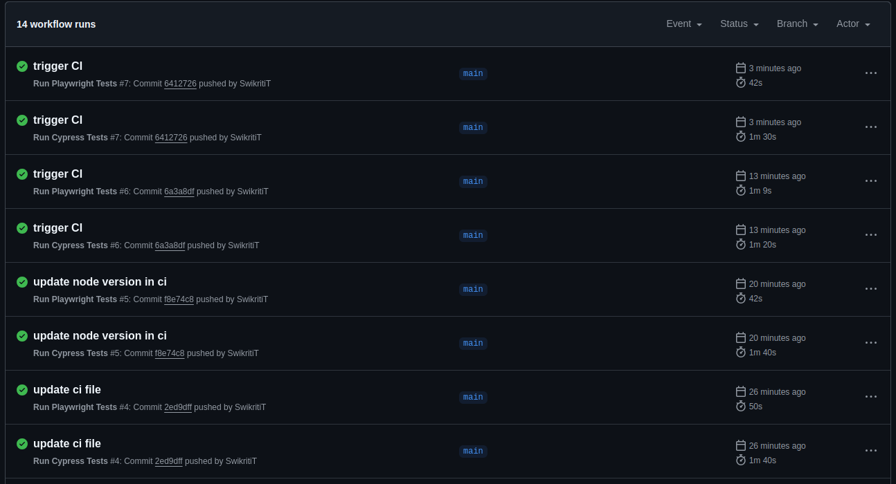

## Comparing Test Execution Speed: Cypress vs Playwright for Modern Test Automation Frameworks

As the testing world increasingly shifts towards automation, it's essential for tests to run efficiently in a CI/CD environment. Quick feedback on the latest code changes is critical—nobody wants to wait an hour or more to see if their pull request passes. Additionally, CI/CD services can be costly, so minimizing execution time directly translates to saving money. Every millisecond counts in this modern testing landscape.

With this in mind, I conducted an experiment to compare the test execution speed of two of today’s most popular modern test automation frameworks: [Cypress](https://www.cypress.io/) and [Playwright](https://playwright.dev/).

If you're not already familiar with these frameworks, here's a brief introduction to each:

**Cypress** is a front-end testing tool designed for modern web applications. Initially built for end-to-end testing, it has since expanded its capabilities to include component testing, accessibility testing, and more. Cypress supports test scripting in JavaScript and TypeScript and offers compatibility with Chromium-based browsers, Firefox, and WebKit (experimental). It operates directly in the browser, providing a seamless developer experience with features like built-in debugging, automatic waiting, and real-time reloading.

**Playwright** is an end-to-end testing framework for modern web applications that supports multiple programming languages, including JavaScript, TypeScript, Python, C#, and Java. It fully supports all major browser engines—Chromium, WebKit, and Firefox—making it an excellent choice for cross-browser testing. With powerful features like multiple browser context handling, parallel execution, and robust language integrations, Playwright is ideal for scalable and efficient test automation in diverse environments.

For this project, I wrote end-to-end tests in a TDD style using both frameworks for the [Swaglabs V1 demo website](https://www.saucedemo.com/v1/index.html). You can find the test scripts in [my GitHub repository here](https://github.com/SwikritiT/swaglabs-tests).

I created three test files for each framework, covering the following functionalities:

- Logging in
- Adding items to the cart
- Checking out

To ensure a fair comparison, I used the same selectors and functions as much as possible, across both frameworks. This approach helps maintain consistency and minimizes discrepancies in the results.

## File structure

For this project, I created a root directory named `swaglabs-tests`, which contains two sub-folders: `cypress-tests` and `playwright-tests`.

**File structure for `cypress-tests`**

```bash
cypress-tests
 ┣ cypress
 ┃ ┣ downloads
 ┃ ┣ e2e
 ┃ ┃ ┣ addToCart.cy.js
 ┃ ┃ ┣ checkout.cy.js
 ┃ ┃ ┗ login.cy.js
 ┃ ┗ support
 ┃ ┃ ┣ commands.js
 ┃ ┃ ┣ e2e.js
 ┃ ┃ ┗ helpers.js
 ┣ README
 ┣ cypress.config.js
 ┣ package-lock.json
 ┗ package.json
```

**File structure for `playwright-tests`**

```bash
playwright-tests
 ┣ helpers
 ┃ ┗ helpers.js
 ┣ playwright-report
 ┃ ┗ index.html
 ┣ test-results
 ┃ ┗ .last-run.json
 ┣ tests
 ┃ ┣ addToCart.spec.js
 ┃ ┣ checkout.spec.js
 ┃ ┗ login.spec.js
 ┣ package-lock.json
 ┣ package.json
 ┗ playwright.config.js
```

## Test execution

Each framework contains 3 test suites with a total of 9 tests:

- Login Suite: 5 tests
- Add to Cart Suite: 2 tests
- Checkout Suite: 2 tests

### In Local Machine

The tests were executed in both headless and headed modes using the Chrome browser.

**Cypress Execution in Headless Mode**

```bash
(Run Finished)


       Spec                                              Tests  Passing  Failing  Pending  Skipped
  ┌────────────────────────────────────────────────────────────────────────────────────────────────┐
  │ ✔  addToCart.cy.js                          00:09        2        2        -        -        - │
  ├────────────────────────────────────────────────────────────────────────────────────────────────┤
  │ ✔  checkout.cy.js                           00:10        2        2        -        -        - │
  ├────────────────────────────────────────────────────────────────────────────────────────────────┤
  │ ✔  login.cy.js                              00:06        5        5        -        -        - │
  └────────────────────────────────────────────────────────────────────────────────────────────────┘
    ✔  All specs passed!                        00:26        9        9        -        -        -

```

Cypress executed the tests in 26 seconds, with repeated runs showing execution times ranging from 21 seconds to 26 seconds, averaging at 24 seconds.

**Playwright Execution in Headless Mode**
By default, Playwright runs tests in parallel across multiple workers. To ensure a fair comparison with Cypress, I configured Playwright to run tests sequentially with a single worker by updating the `playwright.config.js` file:

```js
//playwright.config.js

export default defineConfig({}
    .....

	fullyParallel: false, // Disable parallel execution
    workers: 1, // Use a single worker
)
```

```bash
Running 9 tests using 1 worker

  ✓  1 [chromium] › addToCart.spec.js:9:6 › Add to cart › user adds a item to cart (3.9s)
  ✓  2 [chromium] › addToCart.spec.js:13:6 › Add to cart › user adds multiple items to cart (1.9s)
  ✓  3 [chromium] › checkout.spec.js:9:6 › checkout › user checks-out a item from the cart (2.2s)
  ✓  4 [chromium] › checkout.spec.js:14:6 › checkout › user checks-out multiple items from the cart (2.1s)
  ✓  5 [chromium] › login.spec.js:9:6 › Login › normal user logs in (1.5s)
  ✓  6 [chromium] › login.spec.js:18:6 › Login › locked out user logs in (435ms)
  ✓  7 [chromium] › login.spec.js:28:6 › Login › user logs in with no password (443ms)
  ✓  8 [chromium] › login.spec.js:37:6 › Login › user submits empty form (394ms)
  ✓  9 [chromium] › login.spec.js:45:6 › Login › user logs in with incorrect password (423ms)

  9 passed (13.8s)

```

Playwright completed the execution in around 14 seconds, with repeated runs ranging from 13 seconds to 15 seconds, averaging at 14 seconds. This is almost half the time Cypress took.

**Cypress Execution in Headed Mode**

```bash
  (Run Finished)

       Spec                                              Tests  Passing  Failing  Pending  Skipped
  ┌────────────────────────────────────────────────────────────────────────────────────────────────┐
  │ ✔  addToCart.cy.js                          00:06        2        2        -        -        - │
  ├────────────────────────────────────────────────────────────────────────────────────────────────┤
  │ ✔  checkout.cy.js                           00:09        2        2        -        -        - │
  ├────────────────────────────────────────────────────────────────────────────────────────────────┤
  │ ✔  login.cy.js                              00:06        5        5        -        -        - │
  └────────────────────────────────────────────────────────────────────────────────────────────────┘
    ✔  All specs passed!                        00:21        9        9        -        -        -


```

In headed mode, Cypress executed the tests in 21 seconds. The execution time ranged from 20 to 22 seconds in repeated runs, averaging at 21 seconds.

**Playwright Execution in Headed Mode**

```bash
Running 9 tests using 1 worker

  ✓  1 [chromium] › addToCart.spec.js:9:6 › Add to cart › user adds a item to cart (3.9s)
  ✓  2 [chromium] › addToCart.spec.js:13:6 › Add to cart › user adds multiple items to cart (2.0s)
  ✓  3 [chromium] › checkout.spec.js:9:6 › checkout › user checks-out a item from the cart (3.1s)
  ✓  4 [chromium] › checkout.spec.js:14:6 › checkout › user checks-out multiple items from the cart (2.6s)
  ✓  5 [chromium] › login.spec.js:9:6 › Login › normal user logs in (1.6s)
  ✓  6 [chromium] › login.spec.js:18:6 › Login › locked out user logs in (618ms)
  ✓  7 [chromium] › login.spec.js:28:6 › Login › user logs in with no password (580ms)
  ✓  8 [chromium] › login.spec.js:37:6 › Login › user submits empty form (496ms)
  ✓  9 [chromium] › login.spec.js:45:6 › Login › user logs in with incorrect password (587ms)

  9 passed (16.3s)
```

In headed mode, Playwright completed the tests in around 16.3 seconds. The execution time ranged from 15 to 16 seconds, with an average of 15.5 seconds. This is still quicker than Cypress, despite a slight overhead in headed mode.

### **Summary of Test Execution in Local Machine**

| **Mode**     | **Framework** | **Average Execution Time** | **Execution Range** |
| ------------ | ------------- | -------------------------- | ------------------- |
| **Headless** | Cypress       | 24 seconds                 | 21–26 seconds       |
| **Headless** | Playwright    | 14 seconds                 | 13–15 seconds       |
| **Headed**   | Cypress       | 21 seconds                 | 20–22 seconds       |
| **Headed**   | Playwright    | 15.5 seconds               | 15–16 seconds       |

---

### **Key Observations**

1. **Playwright is faster overall.**

   - In headless mode, Playwright is ~42% faster than Cypress.
   - In headed mode, Playwright is ~26% faster than Cypress.

2. **Cypress performance is consistent** across headed and headless modes.

3. **Playwright exhibits slight overhead in headed mode** compared to headless mode but remains faster than Cypress in both modes.

### In CI

I created two workflows for running tests in GitHub actions to see the execution time in CI. The workflow files can be found [here](https://github.com/SwikritiT/swaglabs-tests/tree/main/.github/workflows). Both frameworks are set to run in Chrome browser.

**Cypress Execution in CI**

```bash
 (Run Finished)


       Spec                                              Tests  Passing  Failing  Pending  Skipped
  ┌────────────────────────────────────────────────────────────────────────────────────────────────┐
  │ ✔  addToCart.cy.js                          00:05        2        2        -        -        - │
  ├────────────────────────────────────────────────────────────────────────────────────────────────┤
  │ ✔  checkout.cy.js                           00:06        2        2        -        -        - │
  ├────────────────────────────────────────────────────────────────────────────────────────────────┤
  │ ✔  login.cy.js                              00:04        5        5        -        -        - │
  └────────────────────────────────────────────────────────────────────────────────────────────────┘
    ✔  All specs passed!                        00:17        9        9        -        -        -
```

The total time for test execution took `17 sec`. And the time for the whole CI execution was `1min 40sec` for Cypress. The test execution range was from `15-17` sec with `16 sec` average.


**Playwright Execution in CI**

```bash
Running 9 tests using 1 worker

  ✓  1 [chromium] › addToCart.spec.js:9:6 › Add to cart › user adds a item to cart (1.5s)
  ✓  2 [chromium] › addToCart.spec.js:13:6 › Add to cart › user adds multiple items to cart (1.6s)
  ✓  3 [chromium] › checkout.spec.js:9:6 › checkout › user checks-out a item from the cart (1.6s)
  ✓  4 [chromium] › checkout.spec.js:14:6 › checkout › user checks-out multiple items from the cart (1.7s)
  ✓  5 [chromium] › login.spec.js:9:6 › Login › normal user logs in (1.3s)
  ✓  6 [chromium] › login.spec.js:18:6 › Login › locked out user logs in (188ms)
  ✓  7 [chromium] › login.spec.js:28:6 › Login › user logs in with no password (164ms)
  ✓  8 [chromium] › login.spec.js:37:6 › Login › user submits empty form (162ms)
  ✓  9 [chromium] › login.spec.js:45:6 › Login › user logs in with incorrect password (177ms)

  9 passed (10.0s)
```

The test pipeline took `10 sec` in Playwight and whole CI execution was `42 sec` making it significantly better than Cypress. The test execution range was `9-12 sec` with average of `10.5 sec`


Playwright tests run significantly faster in CI as well making them time efficient.
